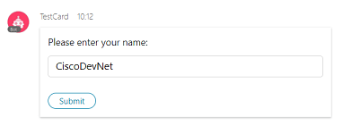

# Build Webex ChatBots in JavaScript

Yet [another opiniated framework](https://github.com/CiscoDevNet/awesome-webex#bot-frameworks) to build [Webex Teams Bots](https://developer.webex.com/bots.html) in Node.js:
- simple design to both learn and experiment Webhooks concepts in a snatch,
- flexibility to let your bot listen to raw Webhook events, or directly respond to commands,  
- supports [Webex Cards](https://github.com/CiscoDevNet/node-sparkbot#capture-inputs-submitted-via-cards) and [webhook check (creation/update)](https://github.com/CiscoDevNet/node-sparkbot#auto-register-webhooks),
- leveraged by a few [DevNet learning labs](https://learninglabs.cisco.com/tracks/collab-cloud/spark-apps/collab-spark-botl-ngrok/step/1), and [bot samples](https://github.com/CiscoDevNet/node-sparkbot-samples). 

This project focusses on the [framework itself](#architecture) and its [testing companions](./tests/README.md).

If you're looking for ready-to-run Chatbots built with the library, jump to the [node-sparkbot-samples repo](https://github.com/CiscoDevNet/node-sparkbot-samples).


## Quickstart

Copy a sample from [Quickstart](quickstart/).

For **Mac, Linux and bash users**, open a terminal and type:

```shell
git clone https://github.com/CiscoDevNet/node-sparkbot
cd node-sparkbot
npm install
DEBUG=sparkbot* node tests/onEvent-all-all.js
```

For **Windows users**, open a command shell and type:

```shell
git clone https://github.com/CiscoDevNet/node-sparkbot
cd node-sparkbot
npm install
set DEBUG=sparkbot*
node tests/onEvent-all-all.js
```

**Done, your bot is live**

Let's check it's live by hitting its healthcheck endpoint:

```
# simply run: curl http://localhost:8080 
# or if you like formatting, install jq and run:
$ curl http://localhost:8080 | jq -C
{
  "message": "Congrats, your Webex Teams webhook is up and running",
  "since": "2016-09-23T07:46:52.397Z",
  "tip": "Register your bot as a WebHook to start receiving events: https://developer.webex.com/endpoint-webhooks-post.html",
  "listeners": [
    "messages/created"
  ],
  "token": false,
  "account": {},
  "interpreter": {},
  "commands": [],
}
```

**Congrats, your bot is now up and running**

Now, let's make Webex post events to our bot.
- if your bot is running on a local machine, you need to [expose your bot to the internet](docs/SettingUpYourSparkBot.md#expose-you-bot).
- and lastly, [register your bot by creating a Webhook](docs/SettingUpYourSparkBot.md#register-your-bot-as-a-spark-webhook).

Note that if you want your bot to respond to commands, add a Webex Teams API token on the command line (see below).

Finally, we suggest you take a look at the [tests](tests/README.md) as they provide a great way to discover the framework features.


### Respond to commands

At startup, the library looks for the ACCESS_TOKEN environment variable.
> Note that ACCESS_TOKEN is still accepted but deprecated as of v1.x of the framework

If present, the library will leverage the token to retreive new message contents, and automatically detect the Webex Teams account associated to the token and take initialization options to fit common scenarios, see [Account detection](#account-type-detection).

As messages flow in, the library automatically removes bot mentions when relevant, so that you can focus on the command itself.

```shell
DEBUG=sparkbot*  ACCCESS_TOKEN=Very_Secret  node tests/onCommand.js

...
  sparkbot webhook instantiated with default configuration +0ms
  sparkbot addMessagesCreatedListener: listener registered +89ms
  sparkbot bot started on port: 8080 +8ms
  sparkbot:interpreter bot account detected, name: CiscoDevNet (bot) +1s
```


### Capture inputs submitted via Cards

We'll use a sample card that proposes a single `name` entry field.



To create the card, create a Webex Teams space and place the following requests with the roomId of your space, typically via Postman.
Note: you can use this [postman collection](https://www.getpostman.com/collections/1f5e101d8290a5303c90) to experiment with Cards. After importing the collection, make sure to add a BOT_TOKEN variable to your Postman environment.

```
POST https://api.ciscospark.com/v1/messages
Authorization: Bearer YOUR_BOT_TOKEN
{{
    "roomId": "{{_room}}",
    "markdown": "[Learn more](https://adaptivecards.io) about Adaptive Cards.",
    "attachments": [
        {
            "contentType": "application/vnd.microsoft.card.adaptive",
            "content": {
                "type": "AdaptiveCard",
                "version": "1.0",
                "body": [
                    {
                        "type": "TextBlock",
                        "text": "Please enter your name:"
                    },
                    {
                        "type": "Input.Text",
                        "id": "name",
                        "title": "New Input.Toggle",
                        "placeholder": "name"
                    }
                ],
                "actions": [
                    {
                        "type": "Action.Submit",
                        "title": "Submit"
                    }
                ]
            }
        }
    ]
}
``` 

As cards are submitted, the [onCardSubmission()]() function invokes your custom code logic.
Note: if a PUBLIC_URL environment variable is present, the example will automatically create a Webhook.

```shell
 DEBUG=sparkbot ACCESS_TOKEN=Y2QzMz_typically_a_bot_token_JlODAzZmItYTVm PUBLIC_URL="https://d3fc85fe.ngrok.io" node tests/onCardSubmission-webhook.js

...
 sparkbot webhook instantiated with default configuration +0ms
  sparkbot bot started on port: 8080 +37ms
  sparkbot webhook already exists with same properties, no creation needed +664ms
webhook successfully checked, with id: Y2lzY29zcGFyazovL3VzL1dFQkhPT0svYTkyYWU5NjMtOTNmYS00YTE0LWEwOGItYTMzMjQ5MzA3MGQ4
  sparkbot webhook invoked +9s
  sparkbot calling listener for resource/event: attachmentActions/created, with data context: Y2lzY29zcGFyazovL3VzL0FUVEFDSE1FTlRfQUNUSU9OLzkyNmEzNDYwLWMzMjktMTFlOS05OGQyLTg5ZDBlNGQyZDU1Mg +6ms
new attachmentActions from personId: Y2lzY29zcGFyazovL3VzL1BFT1BMRS85MmIzZGQ5YS02NzVkLTRhNDEtOGM0MS0yYWJkZjg5ZjQ0ZjQ , with inputs
   name: CiscoDevNet
```


Here is the code used by the sample, hou can check the full code sample here:

```javascript
// Starts your Webhook with a default configuration where the Webex API access token is read from ACCESS_TOKEN
const SparkBot = require("../sparkbot/webhook");
const bot = new SparkBot();

// Create webhook
const publicURL = process.env.PUBLIC_URL || "https://d3fc85fe.ngrok.io";
bot.secret = process.env.WEBHOOK_SECRET || "not THAT secret";
bot.createOrUpdateWebhook("register-bot", publicURL, "attachmentActions", "created", null, bot.secret);
 
// Process new card submissions
bot.onCardSubmission(function (trigger, attachmentActions) {

   console.log(`new attachmentActions from personId: ${trigger.data.personId} , with inputs`);
   Object.keys(attachmentActions.inputs).forEach(prop => {
      console.log(`   ${prop}: ${attachmentActions.inputs[prop]}`);
   });
});
```


## Architecture

The library supports the full set of Webex Teams webhooks, see https://developer.webex.com/webhooks-explained.html

As Webex fires Webhook events, the related listener functions are called.

You can register to listen to a WebHook event by calling the function **".on(<resources>,<event>)"**

Note that the library implements a shortcut that lets you listen to all Webhook events. Check sample code [onEvent-all-all.js](tests/onEvent-all-all.js).

```javascript
var SparkBot = require("sparkbot");
var bot = new SparkBot();
 
bot.onEvent("all", "all", function(trigger) {
  
    // YOUR CODE HERE
    console.log("EVENT: " + trigger.resource + "/" + trigger.event + ", with data id: " + trigger.data.id + ", triggered by person id:" + trigger.actorId);
});
```

This other example code [onEvent-messages-created.js](tests/onEvent-messages-created.js) illustrates how to listen to (Messages/Created) Webhook events.

```javascript
// Starts your Webhook with default configuration where the Webex Teams API access token is read from the ACCESS_TOKEN env variable 
var SparkBot = require("sparkbot");
var bot = new SparkBot();

bot.onEvent("messages", "created", function(trigger) {
    console.log("new message from: " + trigger.data.personEmail + ", in room: " + trigger.data.roomId);
    bot.decryptMessage(trigger, function (err, message) {
        if (err) {
            console.log("could not fetch message contents, err: " + err.message); 
            return;
        }

        // YOUR CODE HERE
        console.log("processing message contents: " + message.text);
    });
});
```


### New message listener

The library also provides a shortcut easy way to listen to only new messages, via the .onMessage() function.

Note that this function is not only a shorcut to create a **".on('messages', 'created')"** listener.
It also automatically fetches for you the text of the new message by requesting Webex Teams for the message details.
As the message is fetched behind the scene, you should position a ACCESS_TOKEN env variable when starting up your bot.

Check the [onMessage.js](tests/onMessage.js) for an example:

```javascript
// Starts your Webhook with default configuration where the Webex Teams API access token is read from the ACCESS_TOKEN env variable 
SparkBot = require("node-sparkbot");
var bot = new SparkBot();
 
bot.onMessage(function(trigger, message) {
 
  // ADD YOUR CUSTOM CODE HERE
  console.log("new message from: " + trigger.data.personEmail + ", text: " + message.text);
});
```

Note that most of the time, you'll want to check for the presence of a keyword to take action.
To that purpose, you can check this example: [onMessage-asCommand](tests/onMessage-asCommand.js).

```javascript
// Starts your Webhook with default configuration where the Webex Teams API access token is read from the ACCESS_TOKEN env variable 
var SparkBot = require("node-sparkbot");
var bot = new SparkBot();

bot.onMessage(function (trigger, message) {
    console.log("new message from: " + trigger.data.personEmail + ", text: " + message.text);

    var command = bot.asCommand(message);
    if (command) {
        // // ADD YOUR CUSTOM CODE HERE
        console.log("detected command: " + command.keyword + ", with args: " + JSON.stringify(command.args));
    }
});
```

_Note that The onCommand function below is pretty powerful, as it not only checks for command keywords, but also removes any mention of your bot, as this mention is a Webex pre-requisite for your bot to receive a message in a group space,
but it meaningless for your bot to process the message._

Well that said, we're ready to go thru the creation of interactive assistants.


### Interactive assistants

To implement an interative assistant, you would typically:
- respond to commands (keywords) via an `onCommand()` listener function
   - with an option to trim mention if your bot is mentionned in a group room
   - and an option to specify a fallback command
   - please check [onCommand](tests/onCommand.js) sample
- respond to attachementActions submissions (cards) via an `onCardSubmission()` listener function
   - please check [onCardSubmission](tests/onCardSubmission.js) sample
- manually create a webhook via a POST /webhooks request against the Webex REST API
   - OR use the `createOrUpdateWebhook()` function 
   - please check [onCommand-webhook](tests/onCommand-webhook.js) or [onCardSubmission-webhook](tests/onCardSubmission-webhook.js) samples


### Healthcheck

The library automatically exposes an healthcheck endpoint.
As such, hitting GET / will respond a 200 OK with an attached JSON payload.

The healcheck JSON payload will give you extra details: 
- token:true  // if a token was detected at launch
- account     // detailled info about the Webex Teams account tied to the token
- listeners   // events for which your bot has registered a listener
- commands    // commands for which your bot is ready to be activated
- interpreter // preferences for the command interpreter

   
```json
// Example of a JSON healthcheck
{
  "message": "Congrats, your Webex Teams bot is up and running",
  "since": "2016-09-01T13:15:39.425Z",
  "tip": "Register webhooks for your bot to start receiving events: https://developer.webex.com/endpoint-webhooks-post.html"
  "listeners": [
    "messages/created"
  ],
  "token": true,
  "account": {
    "type": "human",
    "person": {
      "id": "Y2lzY29zcGFyazovL3VzL1BFT1BMRS85MmIzZGQ5YS02NzVkLTRhNDEtOGM0MS0yYWJkZjg5ZjQ0ZjQ",
      "emails": [
        "stsfartz@cisco.com"
      ],
      "displayName": "Stève Sfartz",
      "avatar": "https://1efa7a94ed216783e352-c62266528714497a17239ececf39e9e2.ssl.cf1.rackcdn.com/V1~c2582d2fb9d11e359e02b12c17800f09~aqSu09sCTVOOx45HJCbWHg==~1600",
      "created": "2016-02-04T15:46:20.321Z"
    }
  },
  "interpreter": {
    "prefix": "/",
    "trimMention": true,
    "ignoreSelf": false
  },
  "commands": [
    "help"
  ]
}
``` 


### Account Type Detection

If a Webex teams API access token has been specified at launch, the library will request details about the Webex Teams account.
From the person details provided, the library will infer if the token matches a individual (HUMAN) or a bot account (MACHINE).
Because of restrictions concerning bots, the library will setup a default behavior from the account type, unless configuration parameters have already been provided at startup.

_Note that the automatic account detection procedure is done asynchronously at launch._

Here is the set of extra information and behaviors that relate to the automatic bot detection:
    - your bot is populated with an account property
    - your bot is added a nickName property
    - a type is attached to your bot instance [HUMAN | MACHINE | OTHER]


### Authenticating Requests via payload signature 

To ensure paylods received by your bots come from Webex, you can supply a secret parameter at Webhook creation.
Every payload posted to your bot will then contain an extra HTTP header "X-Spark-Signature" containing an HMAC-SHA1 signature of the payload.

Once you've created the webhook for your bot with a secret parameter, 
you can either specify a SECRET environment variable on the command line or in your code.

Command line example:
```shell
DEBUG=sparkbot*  ACCESS_TOKEN=your_bot_token WEBHOOK_SECRET=your_secret   node tests/onEvent-check-secret.js
...
```

Code example:
```javascript
// Starts your Webhook with default configuration where the Webex Teams API access token is read from the ACCESS_TOKEN env variable 
SparkBot = require("node-sparkbot");
var bot = new SparkBot();
bot.secret = "not THAT secret"
...
```

Note that it is a HIGHLY RECOMMENDED however not mandatory security practice to set up a SECRET. 
If your bot has been started with a secret, then the processing will abort if the incoming payload signature is not present or do not fit.
However, the bot framework defines a flag so that you can ignore signature check failures when a SECRET is defined.


### Auto-Register Webhooks

At startup, node-sparkbot can automatically create a Webhook for your bot, or verify if a webhook already exists with the specified name.
Here are a few of the options supported:
* Simplissime registration where defaults apply (all, all, no filter, no secret), and no callback
   > bot.createOrUpdateWebhook("register-bot", "https://f6d5d937.ngrok.io");
* Registration with no filter, no secret, and no callback
   > bot.createOrUpdateWebhook("register-bot", "https://f6d5d937.ngrok.io", "all", "all");
* Registration with a filter, no secret, no callback
   > bot.createOrUpdateWebhook("register-bot", "https://f6d5d937.ngrok.io", "all", "all", "roomId=XXXXXXXXXXXXXXX");
* Registration with no filter, but a secret and a callback
   > bot.createOrUpdateWebhook("register-bot", publicURL, "all", "all", null, bot.secret, function (err, webhook) { ... }

You can check [onCommand-webhook.js](tests/onCommand-webhook.js) for an example.

```javascript
bot.createOrUpdateWebhook("register-bot", "https://f6d5d937.ngrok.io", "all", "all", null, bot.secret, function (err, webhook) {
  console.log("webhook successfully created, id: " + webhook.id);
});
```


### Minimal footprint

node-sparkbot makes a minimal use of third party libraries :
- debug: as we need a customizable logger
- express & body-parser: as its Web API foundation
- htmlparser2: to filter out the bot mention from the message contents

Morever, node-sparkbot does not embedd any Webex Teams client SDK, 
so that you can choose your favorite (ie, among ciscospark, node-sparky or node-sparkclient...) to interact with Webex.


## Contribute

Feedback, issues, thoughts... please use [github issues](https://github.com/CiscoDevNet/node-sparkbot/issues/new).

Interested in contributing code?
- Check for open issues or create a new one.
- Submit a pull request. Just make sure to reference the issue.
